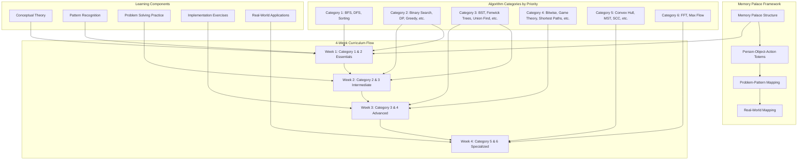
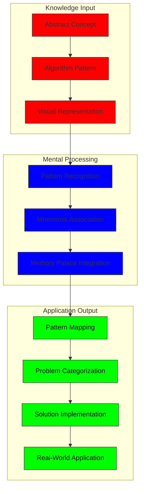
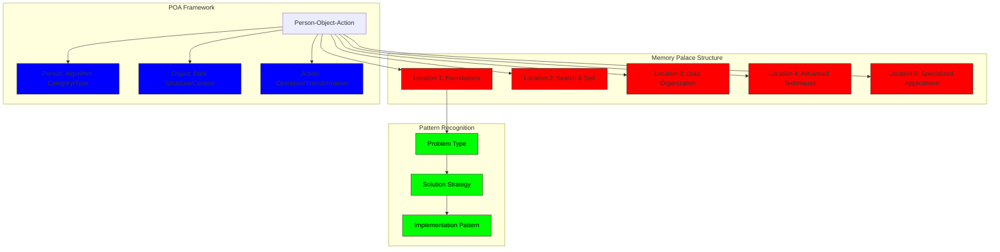

# Data Structures & Algorithms Curriculum

## Terminology and Key Concepts

Before diving into the curriculum, let's establish common terminology:

- **Memory Palace**: A spatial memorization technique that uses visualizations of familiar locations to organize and recall information
- **POA Framework**: Person-Object-Action method for creating memorable associations
- **Pattern Mapping**: Connecting problem structures to known algorithm patterns
- **Totem**: A memorable POA combination that anchors a specific algorithm or data structure concept

## 4-Week Curriculum Breakdown
Here's a comprehensive 4-week curriculum:

### Week 1: Foundations & Essential Patterns

**Focus**: Category 1 (BFS/DFS, Sorting) + Initial Category 2 Topics

#### Day 1-2: Graph Traversal Foundations
- **Theory**: BFS vs DFS mental model - BFS as breadth-first using queues (level order) vs DFS as depth-first using stacks (pre/in/post-order)
- **Pattern Recognition**: When to use BFS (shortest paths, level-based problems) vs DFS (exhaustive search, backtracking)
- **POA Example**: "Explorer (person) with Map (object) Navigating (action)" for BFS/DFS
- **Problem Mapping**: LeetCode problems that don't immediately look like graph problems but are solvable with BFS/DFS

#### Day 3-4: Sorting Algorithms
- **Theory**: Comparison-based vs non-comparison sorting
- **Pattern Recognition**: When to use different sorting algorithms (insertion, merge, quick, etc.)
- **POA Example**: "Librarian (person) with Books (object) Organizing (action)" for sorting
- **Applied Practice**: Solving problems where sorting is an essential but non-obvious step

#### Day 5-7: Binary Search & Hash Maps/Sets
- **Theory**: Binary search for sorted collections, hash map/set for O(1) lookups
- **Pattern Recognition**: Identifying when to use binary search vs hash-based approaches
- **POA Examples**: 
  - "Hunter (person) with Telescope (object) Focusing (action)" for binary search
  - "Receptionist (person) with Rolodex (object) Retrieving (action)" for hash maps/sets
- **Problem Mapping**: Applying these tools to non-obvious problems

### Week 2: Intermediate Patterns & Structures

**Focus**: Remaining Category 2 + Initial Category 3 Topics

#### Day 1-3: Dynamic Programming & Greedy Algorithms
- **Theory**: DP as dependency graph approach, greedy algorithms for local optimization
- **Pattern Recognition**: State variables, memoization, and optimization criteria
- **POA Examples**:
  - "Architect (person) with Blueprint (object) Planning (action)" for DP
  - "Chef (person) with Ingredients (object) Prioritizing (action)" for greedy algorithms
- **Problem Transformations**: Converting between recursive, top-down, and bottom-up approaches

#### Day 4-5: Heaps & Prefix Sums
- **Theory**: Heap operations, prefix sum concepts and applications
- **Pattern Recognition**: K-smallest/largest problems, range sum problems
- **POA Examples**:
  - "Bouncer (person) with Priority List (object) Selecting (action)" for heaps
  - "Accountant (person) with Ledger (object) Summing (action)" for prefix sums
- **Real-World Mapping**: Applications in streaming data, prioritization systems, financial calculations

#### Day 6-7: Linked Lists, Stacks & Topological Sort
- **Theory**: Linked structures, stack operations, and directed acyclic graphs
- **Pattern Recognition**: Dependency ordering, parenthesis matching, reversing operations
- **POA Examples**:
  - "Railway Controller (person) with Train Cars (object) Connecting (action)" for linked lists
  - "Dishwasher (person) with Plates (object) Stacking (action)" for stacks
  - "Project Manager (person) with Task List (object) Sequencing (action)" for topological sort

### Week 3: Advanced Patterns & Techniques

**Focus**: Remaining Category 3 + Category 4 Topics

#### Day 1-2: Binary Search Trees & Union Find
- **Theory**: Tree traversal, balanced trees, disjoint sets, path compression
- **Pattern Recognition**: Hierarchical data, set operations, connectivity problems
- **POA Examples**:
  - "Taxonomist (person) with Species (object) Classifying (action)" for BST
  - "Ambassador (person) with Countries (object) Uniting (action)" for Union Find
- **Implementation Focus**: Self-balancing trees, Union-Find optimizations

#### Day 3-4: String Algorithms & Two Pointers
- **Theory**: String hashing, Knuth-Morris-Pratt, sliding window
- **Pattern Recognition**: Substring problems, palindromes, anagrams
- **POA Examples**:
  - "Linguist (person) with Dictionary (object) Analyzing (action)" for string algorithms
  - "Fencer (person) with Foils (object) Positioning (action)" for two pointers
- **Real-World Applications**: Text processing, pattern matching, search engines

#### Day 5-7: Bitwise Operations & Shortest Paths
- **Theory**: Bit manipulation, Dijkstra's algorithm, Bellman-Ford
- **Pattern Recognition**: State compression, optimization problems, graph distances
- **POA Examples**:
  - "Electrician (person) with Circuit (object) Toggling (action)" for bitwise operations
  - "Navigator (person) with Roadmap (object) Routing (action)" for shortest paths
- **Implementation Practice**: Optimized implementations of these algorithms

### Week 4: Specialized Algorithms & Integration

**Focus**: Categories 5 & 6 + Comprehensive Integration

#### Day 1-2: Convex Hull & Minimum Spanning Trees
- **Theory**: Graham scan, Jarvis march, Kruskal's/Prim's algorithms
- **Pattern Recognition**: Geometric boundaries, network design problems
- **POA Examples**:
  - "Surveyor (person) with Boundary Markers (object) Enclosing (action)" for convex hull
  - "City Planner (person) with Utilities (object) Connecting (action)" for MST
- **Real-World Applications**: Computer graphics, network infrastructure design

#### Day 3-4: Advanced Graph Algorithms & Decomposition
- **Theory**: Strongly connected components, square root decomposition
- **Pattern Recognition**: Complex graph structures, query optimization
- **POA Examples**:
  - "Detective (person) with Criminal Network (object) Uncovering (action)" for SCC
  - "Strategist (person) with Territory (object) Subdividing (action)" for decomposition
- **Applied Problems**: Network analysis, territory division

#### Day 5-7: FFT & Max Flow
- **Theory**: Fast Fourier Transform, Ford-Fulkerson, Edmonds-Karp
- **Pattern Recognition**: Signal processing, network capacity problems
- **POA Examples**:
  - "Musician (person) with Soundwave (object) Transforming (action)" for FFT
  - "Logistics Manager (person) with Pipeline (object) Maximizing (action)" for max flow
- **Real-World Applications**: Digital signal processing, resource allocation, transportation networks

## Daily Session Structure

Each day's learning session will follow this pattern:

1. **Concept Introduction** (30 min)
   - Theory overview with Mermaid diagrams
   - POA memory palace totem introduction

2. **Pattern Recognition** (45 min)
   - Problem categorization exercises
   - Common problem patterns and transformations

3. **Implementation Practice** (60 min)
   - TypeScript/Go implementation examples
   - LeetCode problem solving with pattern analysis

4. **Real-World Mapping** (45 min)
   - Industry applications of the algorithm/structure
   - How these concepts appear in real engineering challenges

## Assessment and Reinforcement Strategy

Throughout the curriculum, we'll implement:

1. **Pattern Blindspot Testing**: Presenting problems that don't obviously map to their optimal algorithm solution
2. **Interleaved Practice**: Mixing problems from different categories to strengthen recognition
3. **Spaced Repetition**: Revisiting earlier concepts as we advance through the curriculum
4. **Implementation Challenges**: Building more complex systems using multiple data structures and algorithms

Would you like me to dive deeper into any specific week or topic? Or would you prefer we start with detailed content for Week 1?