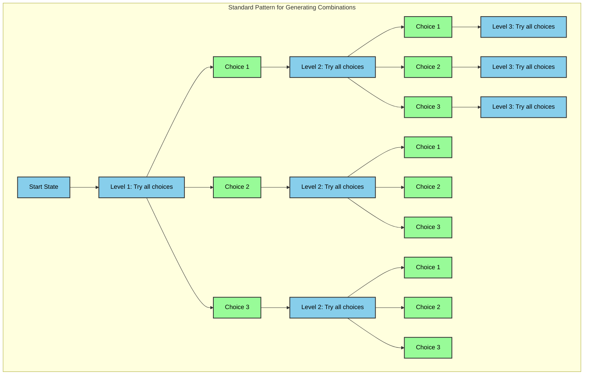

# Backtracking

Backtracking typically involves iterating across levels of a decision tree. At each level, there's a series of choices to make. Going down a level resembles making a single choice, and so at that new deeper level, the choices are slightly different (they probably don't include the choices you've already made). Either way, we need to now iterate across each of those choices. 
This approach is expensive and typically results in exponential time complexity, often denoted as O(b^d), where b is the branching factor and d is the depth of the solution tree. However, with pruning, we can significantly reduce the number of branches we need to explore, thus improving the overall time complexity. 

| Problem    | Time Complexity (Without Pruning) | Time Complexity (With Pruning) |
| ---------- | --------------------------------- | ------------------------------ |
| N-Queens   | O(n!)                             | O(n^n)                         |
| Subset Sum | O(2^n)                            | O(2^(n/2))                     |

Pruning helps eliminate large portions of the search space that do not lead to valid solutions, making the algorithm more efficient.

## Iterate Combinations via Tracing Tree



The standard pattern for generating combinations has these key components:

1. **Level Structure**:
   - Each level represents a position in the combination
   - Number of levels = length of combination
   - Each level tries all possible choices

2. **Choice Structure**:
   - At each level, try every possible choice
   - Number of choices = size of choice set
   - Each choice leads to next level

3. **Recursive Pattern**:
```python
def generate_combinations(level, current_state):
    if level == max_level:
        # Process complete combination
        return
        
    for choice in possible_choices:
        # Try this choice
        current_state[level] = choice
        # Move to next level
        generate_combinations(level + 1, current_state)
        # Backtrack (implicitly by continuing loop)
```

4. **Key Characteristics**:
   - Each level is independent
   - All choices at each level are tried
   - State is passed down the tree
   - Backtracking happens by continuing the loop

### This pattern appears in many problems:
- N-Queens: Each level is a row, choices are columns
- Permutations: Each level is a position, choices are remaining numbers
- Subsets: Each level is whether to include an element
- Sudoku: Each level is a cell, choices are numbers 1-9


### What's different between problems? 🎯

The main difference between problems is:
1. **Choices**: What constitutes a "choice" at each level
2. **Pruning**: What constraints are applied to prune invalid branches
3. **Valid Criteria**: What constitutes a valid complete combination

