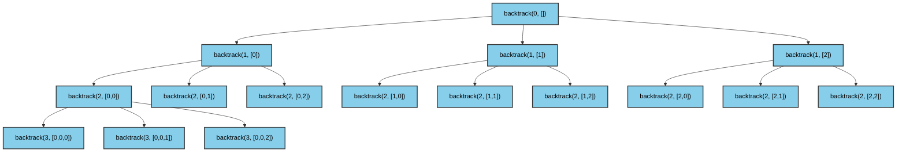
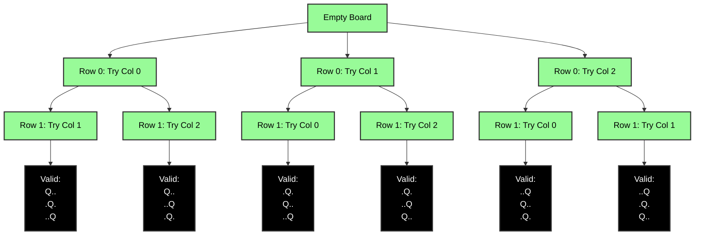
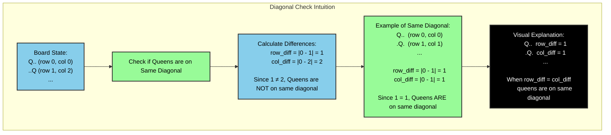

# **N-Queens Problem**:


The N-Queens problem combines two distinct patterns:

1. **Recursive Pattern (First Diagram)**:
   - Shows the basic structure of generating all possible permutations
   - Each node represents a recursive call with current state
   - No constraints are applied
   - Shows the exponential growth of possibilities (3^n for n=3)

2. **Queen Placement Problem (Second Diagram)**:
   - Shows the actual problem constraints
   - Each node represents a valid queen placement
   - Visualizes the board state
   - Shows how the N-Queens constraints prune the search space
   - Only valid placements are shown

----

## N-Queens Tracing Tree





The N-Queens problem combines two distinct patterns:

1. **Recursive Pattern (First Diagram)**:
   - Shows the basic structure of generating all possible permutations
   - Each node represents a recursive call with current state
   - No constraints are applied
   - Shows the exponential growth of possibilities (3^n for n=3)

2. **Queen Placement Problem (Second Diagram)**:
   - Shows the actual problem constraints
   - Each node represents a valid queen placement
   - Visualizes the board state
   - Shows how the N-Queens constraints prune the search space
   - Only valid placements are shown

The key insight is that the N-Queens problem uses the recursive permutation pattern as its foundation, but adds the queen placement constraints to prune invalid branches. This is why:
- The first diagram shows 27 possible states (3^3)
- The second diagram shows only 6 valid solutions
- The `is_valid()` function acts as a pruning mechanism


For n=3, the algorithm explores all possible placements:
1. Each node shows `backtrack(row, board_state)`
2. The board state array shows queen positions for each row
3. -1 indicates no queen placed yet
4. Numbers 0-2 indicate queen position in that row
5. Valid solutions are marked in black
6. Invalid branches are pruned (not shown)

The tree shows how the algorithm:
1. Tries each column (0,1,2) for the first row
2. For each valid first row placement, tries columns for the second row
3. For each valid second row placement, tries columns for the third row
4. When row=n, a solution is found and added to solutions list

```python
def solve_n_queens(n):
    def is_valid(board, current_row, current_col):
        """
        Check if we can place a queen at (current_row, current_col)
        
        Args:
            board: List where board[i] = column of queen in row i
            current_row: Row we're trying to place a queen in
            current_col: Column we're trying to place a queen in
            
        Returns:
            bool: True if we can place a queen here, False otherwise
        """
        # Check each row we've placed queens in so far
        for previous_row in range(current_row):
            previous_col = board[previous_row]
            
            # Check if queens are in same column
            if previous_col == current_col:
                return False
                
            # Check if queens are on same diagonal
            # Two queens are on same diagonal if:
            # |row1 - row2| = |col1 - col2|
            row_diff = abs(previous_row - current_row)
            col_diff = abs(previous_col - current_col)
            if row_diff == col_diff:
                return False
        
        return True
    
    def backtrack(row, current_board):
        if row == n:
            solutions.append(current_board[:])
            return
        
        for col in range(n):
            if is_valid(current_board, row, col):
                current_board[row] = col
                backtrack(row + 1, current_board)
                # Backtrack by continuing loop (implicitly undoing the choice)
    
    solutions = []
    backtrack(0, [-1] * n)
    return solutions
```

Let's break down how `is_valid` works with a concrete example for n=3:

```python
# Example board state:
# board = [1, -1, -1]  # Queen in row 0, col 1
# current_row = 1
# current_col = 2

def is_valid(board, current_row, current_col):
    # For current_row = 1, we only need to check row 0
    for previous_row in range(current_row):  # range(1) = [0]
        previous_col = board[previous_row]    # board[0] = 1
        
        # Check same column
        if previous_col == current_col:       # 1 != 2, so continue
            return False
            
        # Check diagonal
        row_diff = abs(previous_row - current_row)    # |0 - 1| = 1
        col_diff = abs(previous_col - current_col)    # |1 - 2| = 1
        if row_diff == col_diff:                      # 1 == 1, so diagonal conflict!
            return False
    
    return True
```

The key insights about `is_valid`:

1. **Board Representation**:
   - `board[i]` stores the column number of the queen in row i
   - -1 means no queen placed yet in that row

2. **Conflict Checking**:
   - We only need to check rows before our current row
   - Two types of conflicts:
     a. Same column: `previous_col == current_col`
     b. Same diagonal: `|row1 - row2| = |col1 - col2|`

3. **Diagonal Check Intuition**:
   - Queens are on same diagonal if the difference in their rows equals the difference in their columns
   - This works for both upward and downward diagonals

4. **Efficiency**:
   - Only checks previous rows (O(n) time)
   - No need to check future rows or same row
   - No need to check rows beyond current row since we place queens row by row

Would you like me to add a visual diagram showing how the diagonal check works, or would you like to see more examples of how `is_valid` works with different board states?

The diagonal check works because:
1. For any two queens on the same diagonal:
   - The difference in their rows equals the difference in their columns
   - This works for both upward and downward diagonals

2. Example 1 (Different Diagonals):
   - Queen 1: (row 0, col 0)
   - Queen 2: (row 1, col 2)
   - row_diff = |0 - 1| = 1
   - col_diff = |0 - 2| = 2
   - Since 1 ≠ 2, queens are not on same diagonal

3. Example 2 (Same Diagonal):
   - Queen 1: (row 0, col 0)
   - Queen 2: (row 1, col 1)
   - row_diff = |0 - 1| = 1
   - col_diff = |0 - 1| = 1
   - Since 1 = 1, queens are on same diagonal

This is why in the `is_valid` function we check:
```python
row_diff = abs(previous_row - current_row)
col_diff = abs(previous_col - current_col)
if row_diff == col_diff:
    return False  # Queens are on same diagonal
```


