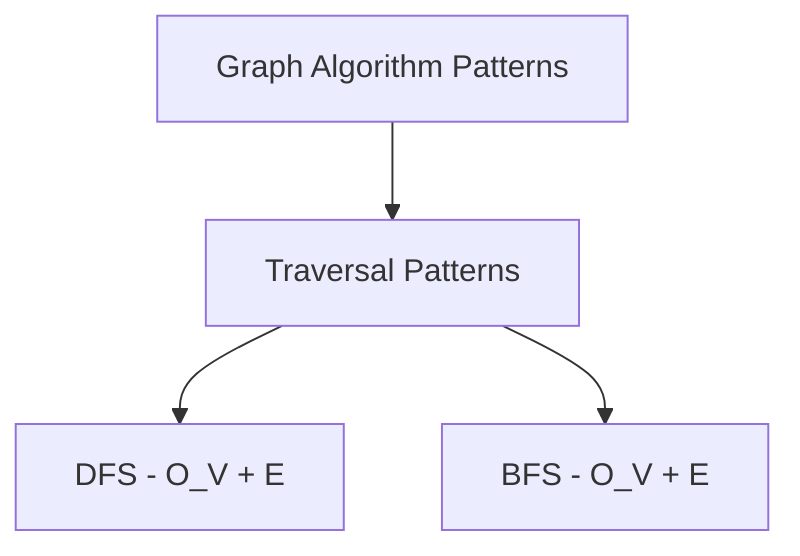
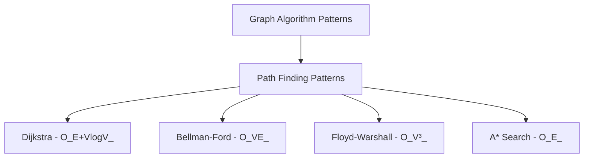
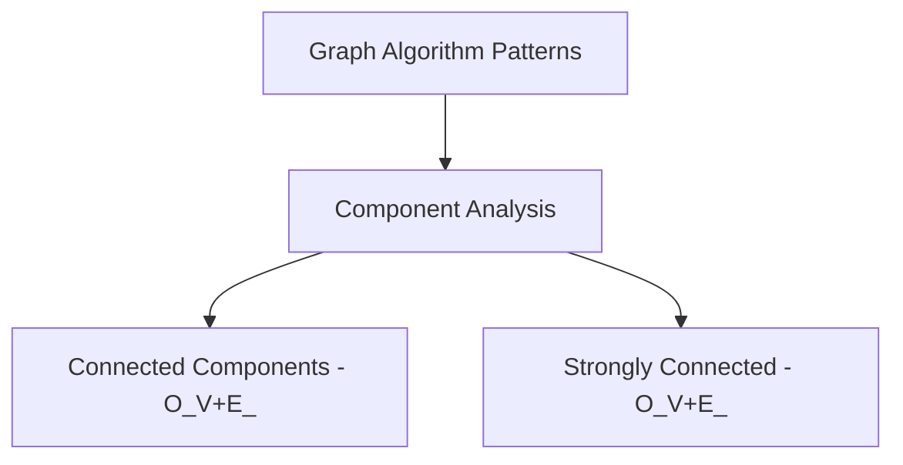
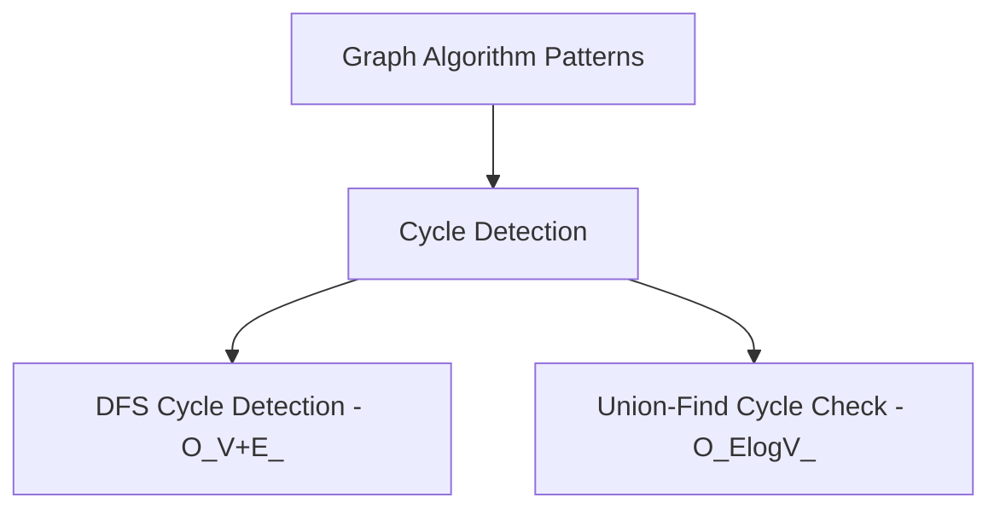
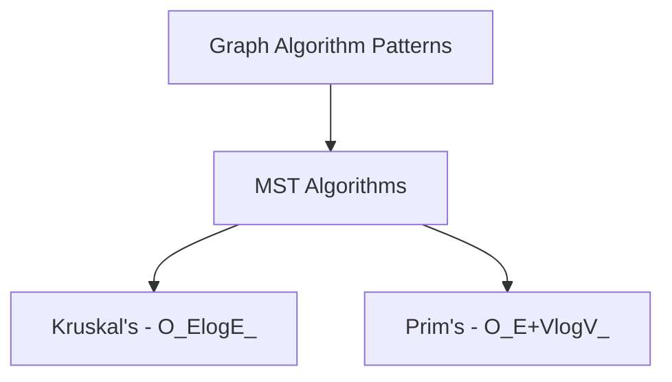
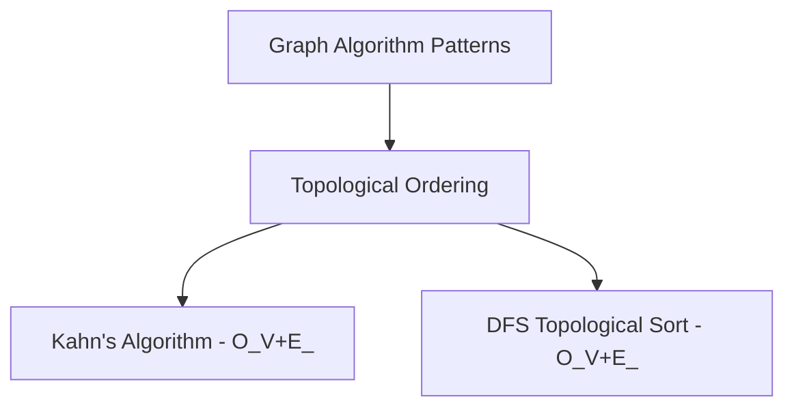
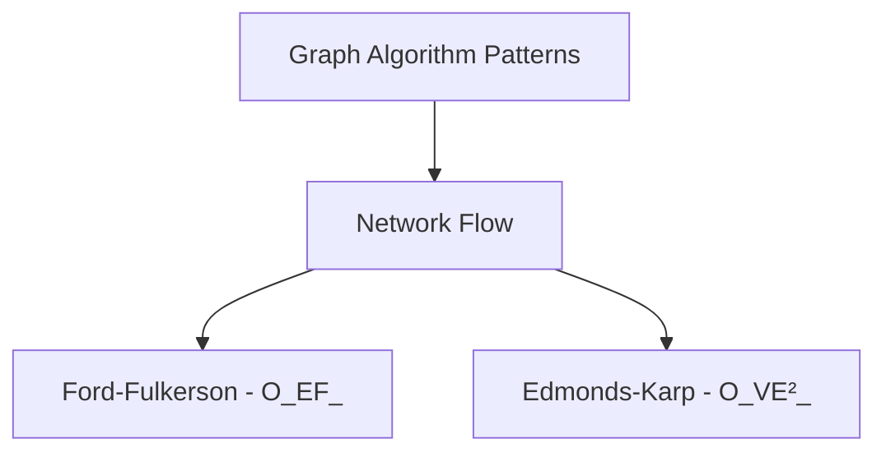
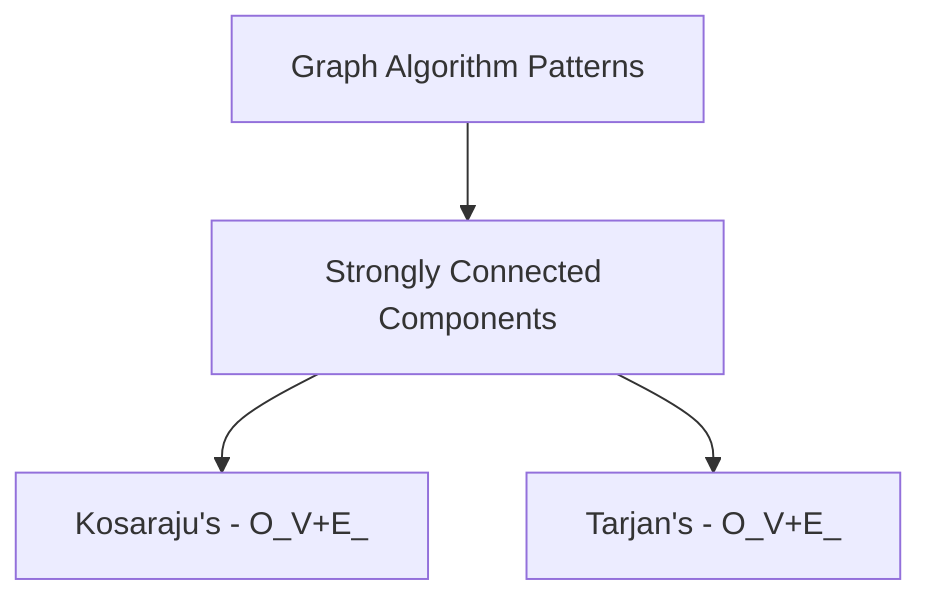
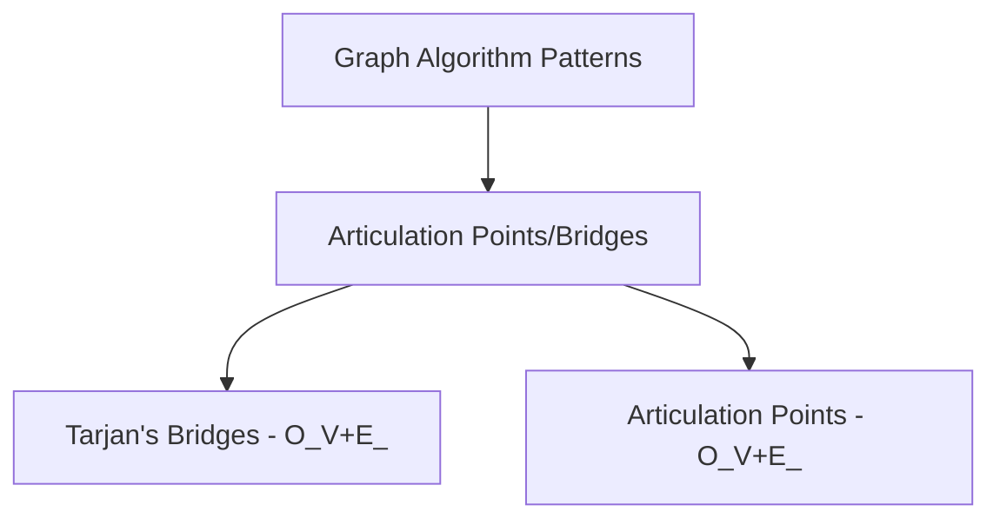
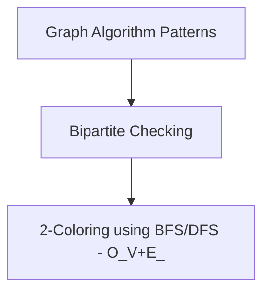

# Graph Algos

* _Algorithms_:
  - BFS
  - DFS
  - Union Find
  - Kruskal + Union Find
  - Dijksta
  - Bellman Ford
  - Floyd Warshall
  - Prims
  - Kosaraju
  - Ford-Fulkerson
  - A* Search
* _Patterns_
  - Find Connected Components
  - Cycle Detection
  - Topological Sort
  - Shortest Path (unweighted graph)
  - Bipartite Graph Check
  - Strongly Connected Components
  - Minimum Spanning Tree
  - Articulation Points & Bridges
  - Network Flow


I'll help you enumerate common graph algorithm patterns with their time complexities, preceded by a Mermaid diagram to establish our shared mental model.

# Common Graph Algorithm Patterns

## Detailed Pattern Diagrams





















Based on our mental model diagram, let's explore 10 common graph algorithm patterns with Python implementations and time complexities.

## 1. Connected Components Detection

Finding all connected components in an undirected graph.

```python
# Depth: O(V) - We process each vertex once
# Breadth: O(E) - We process each edge once
# Final: O(V+E)

def find_connected_components(graph):
    visited = set()
    components = []
    
    def dfs(node, component):
        visited.add(node)
        component.append(node)
        for neighbor in graph[node]:
            if neighbor not in visited:
                dfs(neighbor, component)
    
    for node in graph:
        if node not in visited:
            component = []
            dfs(node, component)
            components.append(component)
    
    return components

# Example usage:
graph = {
    'A': ['B'],
    'B': ['A', 'C'],
    'C': ['B'],
    'D': ['E'],
    'E': ['D', 'F'],
    'F': ['E'],
    'G': []
}
print(find_connected_components(graph))  # Output: [['A', 'B', 'C'], ['D', 'E', 'F'], ['G']]
```

## 2. Cycle Detection in Directed Graphs

Detecting cycles in a directed graph using DFS.

```python
# Depth: O(V) - We process each vertex once
# Breadth: O(E) - We process each edge once
# Final: O(V+E)

def has_cycle(graph):
    visited = set()
    rec_stack = set()
    
    def dfs_cycle(node):
        visited.add(node)
        rec_stack.add(node)
        
        for neighbor in graph[node]:
            if neighbor not in visited:
                if dfs_cycle(neighbor):
                    return True
            elif neighbor in rec_stack:
                return True
                
        rec_stack.remove(node)
        return False
    
    for node in graph:
        if node not in visited:
            if dfs_cycle(node):
                return True
    
    return False

# Example usage:
graph = {
    'A': ['B'],
    'B': ['C'],
    'C': ['A']  # Creates a cycle A -> B -> C -> A
}
print(has_cycle(graph))  # Output: True
```

## 3. Topological Sort

Ordering vertices such that for every directed edge (u, v), vertex u comes before v in the ordering.

```python
# Depth: O(V) - We process each vertex once
# Breadth: O(E) - We process each edge once
# Final: O(V+E)

def topological_sort(graph):
    visited = set()
    result = []
    
    def dfs(node):
        visited.add(node)
        for neighbor in graph.get(node, []):
            if neighbor not in visited:
                dfs(neighbor)
        result.append(node)
    
    for node in graph:
        if node not in visited:
            dfs(node)
    
    return result[::-1]  # Reverse to get correct topological order

# Example usage:
graph = {
    'A': ['C'],
    'B': ['C', 'D'],
    'C': ['E'],
    'D': ['F'],
    'E': ['F', 'H'],
    'F': ['G'],
    'G': [],
    'H': []
}
print(topological_sort(graph))  # Output: ['B', 'A', 'C', 'D', 'E', 'F', 'H', 'G']
```

## 4. Shortest Path using BFS (Unweighted Graphs)

Finding shortest paths in an unweighted graph.

```python
# Depth: O(V) - We process each vertex once
# Breadth: O(E) - We process each edge once
# Final: O(V+E)

from collections import deque

def shortest_path_bfs(graph, start, end):
    if start == end:
        return [start]
    
    visited = {start}
    queue = deque([(start, [start])])
    
    while queue:
        node, path = queue.popleft()
        
        for neighbor in graph[node]:
            if neighbor not in visited:
                new_path = path + [neighbor]
                
                if neighbor == end:
                    return new_path
                
                visited.add(neighbor)
                queue.append((neighbor, new_path))
    
    return None  # No path exists

# Example usage:
graph = {
    'A': ['B', 'C'],
    'B': ['A', 'D', 'E'],
    'C': ['A', 'F'],
    'D': ['B'],
    'E': ['B', 'F'],
    'F': ['C', 'E']
}
print(shortest_path_bfs(graph, 'A', 'F'))  # Output: ['A', 'C', 'F']
```

## 5. Bipartite Graph Checking

Checking if a graph can be divided into two sets of vertices where no edge connects vertices in the same set.

```python
# Depth: O(V) - We process each vertex once
# Breadth: O(E) - We process each edge once
# Final: O(V+E)

from collections import deque

def is_bipartite(graph):
    colors = {}  # 0 for one set, 1 for the other set
    
    for start_node in graph:
        if start_node in colors:
            continue
            
        queue = deque([start_node])
        colors[start_node] = 0  # Color the first node
        
        while queue:
            node = queue.popleft()
            
            for neighbor in graph[node]:
                if neighbor not in colors:
                    colors[neighbor] = 1 - colors[node]  # Assign opposite color
                    queue.append(neighbor)
                elif colors[neighbor] == colors[node]:
                    return False  # Not bipartite
    
    return True

# Example usage:
graph = {
    'A': ['B', 'D'],
    'B': ['A', 'C'],
    'C': ['B', 'D'],
    'D': ['A', 'C']
}
print(is_bipartite(graph))  # Output: True
```

## 6. Strongly Connected Components (Kosaraju's Algorithm)

Finding strongly connected components in a directed graph.

```python
# Depth: O(V) - We process each vertex twice
# Breadth: O(E) - We process each edge twice
# Final: O(V+E)

def kosaraju_algorithm(graph):
    finishing_order = []
    strongly_connected_components = []
    
    def dfs_first_pass(node):
        visited.add(node)
        for neighbor in graph.get(node, []):
            if neighbor not in visited:
                dfs_first_pass(neighbor)
        finishing_order.append(node)
    
    def dfs_second_pass(node, component):
        visited.add(node)
        component.append(node)
        for neighbor in reversed_graph.get(node, []):
            if neighbor not in visited:
                dfs_second_pass(neighbor, component)
    
    # Create reversed graph
    reversed_graph = {}
    for node in graph:
        for neighbor in graph[node]:
            if neighbor not in reversed_graph:
                reversed_graph[neighbor] = []
            reversed_graph[neighbor].append(node)
            if node not in reversed_graph:
                reversed_graph[node] = []
    
    # First DFS pass to get finishing order
    visited = set()
    for node in graph:
        if node not in visited:
            dfs_first_pass(node)
    
    # Second DFS pass to find SCCs
    visited = set()
    for node in reversed(finishing_order):
        if node not in visited:
            component = []
            dfs_second_pass(node, component)
            strongly_connected_components.append(component)
    
    return strongly_connected_components

# Example usage:
graph = {
    'A': ['B'],
    'B': ['C', 'E', 'F'],
    'C': ['D', 'G'],
    'D': ['C', 'H'],
    'E': ['A', 'F'],
    'F': ['G'],
    'G': ['F'],
    'H': ['D', 'G']
}
print(kosaraju_algorithm(graph))  # Output: [['A', 'E', 'B'], ['F', 'G'], ['C', 'D', 'H']]
```

## 7. Minimum Spanning Tree (Kruskal's Algorithm)

Finding a minimum spanning tree using Kruskal's algorithm with Union-Find.

```python
# Depth: O(E log E) - Sorting edges
# Breadth: O(E log V) - Union-Find operations
# Final: O(E log E)

def kruskal_algorithm(vertices, edges):
    # Union-Find data structure
    parent = {v: v for v in vertices}
    rank = {v: 0 for v in vertices}
    
    def find(x):
        if parent[x] != x:
            parent[x] = find(parent[x])  # Path compression
        return parent[x]
    
    def union(x, y):
        root_x = find(x)
        root_y = find(y)
        
        if root_x == root_y:
            return
        
        # Union by rank
        if rank[root_x] < rank[root_y]:
            parent[root_x] = root_y
        elif rank[root_x] > rank[root_y]:
            parent[root_y] = root_x
        else:
            parent[root_y] = root_x
            rank[root_x] += 1
    
    # Sort edges by weight
    edges.sort(key=lambda x: x[2])
    
    mst = []
    for u, v, weight in edges:
        if find(u) != find(v):  # Check if adding this edge creates a cycle
            union(u, v)
            mst.append((u, v, weight))
    
    return mst

# Example usage:
vertices = {'A', 'B', 'C', 'D'}
edges = [
    ('A', 'B', 1),
    ('A', 'C', 4),
    ('B', 'C', 2),
    ('B', 'D', 5),
    ('C', 'D', 3)
]
print(kruskal_algorithm(vertices, edges))  # Output: [('A', 'B', 1), ('B', 'C', 2), ('C', 'D', 3)]
```

## 8. Articulation Points and Bridges

Finding critical nodes and edges in a graph whose removal increases the number of connected components.

```python
# Depth: O(V) - We process each vertex once
# Breadth: O(E) - We process each edge once
# Final: O(V+E)

def find_articulation_points(graph):
    n = len(graph)
    discovery = {node: -1 for node in graph}
    low = {node: -1 for node in graph}
    articulation_points = set()
    time = [0]
    
    def dfs(u, parent):
        children = 0
        discovery[u] = low[u] = time[0]
        time[0] += 1
        
        for v in graph[u]:
            if v == parent:
                continue
                
            if discovery[v] == -1:  # If v is not visited
                children += 1
                dfs(v, u)
                
                low[u] = min(low[u], low[v])
                
                # Case 1: u is root and has multiple children
                if parent is None and children > 1:
                    articulation_points.add(u)
                
                # Case 2: u is not root and low value of one of its children
                # is more than or equal to discovery value of u
                if parent is not None and low[v] >= discovery[u]:
                    articulation_points.add(u)
                    
            else:  # Update low value of u for already visited adjacent v
                low[u] = min(low[u], discovery[v])
    
    for node in graph:
        if discovery[node] == -1:
            dfs(node, None)
            
    return articulation_points

# Example usage:
graph = {
    'A': ['B', 'C'],
    'B': ['A', 'D'],
    'C': ['A', 'D'],
    'D': ['B', 'C', 'E'],
    'E': ['D', 'F', 'G'],
    'F': ['E'],
    'G': ['E']
}
print(find_articulation_points(graph))  # Output: {'D', 'E'}
```

## 9. Network Flow (Ford-Fulkerson Algorithm)

Finding the maximum flow in a network.

```python
# Depth: O(F) - Where F is the maximum flow value
# Breadth: O(E) - Each augmenting path can be found in O(E) time
# Final: O(E*F)

def ford_fulkerson(graph, source, sink):
    parent = {}
    max_flow = 0
    
    def bfs():
        nonlocal parent
        parent = {}
        visited = {source}
        queue = [source]
        
        while queue:
            u = queue.pop(0)
            for v in graph[u]:
                if v not in visited and residual_capacity[u][v] > 0:
                    queue.append(v)
                    visited.add(v)
                    parent[v] = u
                    
        return sink in visited
    
    # Create residual capacity matrix
    residual_capacity = {u: {v: graph[u].get(v, 0) for v in graph} for u in graph}
    
    # Augment flow while there is a path from source to sink
    while bfs():
        # Find minimum residual capacity along the path
        path_flow = float('inf')
        s = sink
        while s != source:
            path_flow = min(path_flow, residual_capacity[parent[s]][s])
            s = parent[s]
            
        # Update residual capacities
        max_flow += path_flow
        s = sink
        while s != source:
            u = parent[s]
            residual_capacity[u][s] -= path_flow
            if s not in residual_capacity:
                residual_capacity[s] = {}
            if u not in residual_capacity[s]:
                residual_capacity[s][u] = 0
            residual_capacity[s][u] += path_flow
            s = parent[s]
            
    return max_flow

# Example usage:
graph = {
    'S': {'A': 3, 'B': 2},
    'A': {'B': 1, 'C': 3, 'D': 4},
    'B': {'D': 2},
    'C': {'T': 2},
    'D': {'C': 1, 'T': 3},
    'T': {}
}
print(ford_fulkerson(graph, 'S', 'T'))  # Output: 5
```

## 10. A* Search Algorithm

Finding the shortest path using a heuristic function.

```python
# Depth: O(V) - In worst case, we visit all vertices
# Breadth: O(E) - In worst case, we examine all edges
# Final: O(E + V log V) with efficient priority queue

import heapq

def a_star_search(graph, start, goal, heuristic):
    open_set = [(0 + heuristic[start], 0, start, [start])]  # (f, g, node, path)
    closed_set = set()
    
    while open_set:
        f, g, current, path = heapq.heappop(open_set)
        
        if current == goal:
            return path, g
            
        if current in closed_set:
            continue
            
        closed_set.add(current)
        
        for neighbor, weight in graph[current].items():
            if neighbor in closed_set:
                continue
                
            new_g = g + weight
            new_f = new_g + heuristic[neighbor]
            new_path = path + [neighbor]
            
            heapq.heappush(open_set, (new_f, new_g, neighbor, new_path))
    
    return None, float('inf')  # No path found

# Example usage:
graph = {
    'A': {'B': 1, 'C': 3},
    'B': {'A': 1, 'C': 1, 'D': 4},
    'C': {'A': 3, 'B': 1, 'D': 1},
    'D': {'B': 4, 'C': 1}
}

# Heuristic values (straight-line distance to goal)
heuristic = {
    'A': 4,
    'B': 2,
    'C': 1,
    'D': 0  # D is the goal
}

path, cost = a_star_search(graph, 'A', 'D', heuristic)
print(f"Path: {path}, Cost: {cost}")  # Output: Path: ['A', 'B', 'C', 'D'], Cost: 3
```

These 10 graph algorithm patterns cover most of the common graph problems you'll encounter. Each has its own specific use case and time complexity, making them suitable for different scenarios based on the graph structure and problem requirements.