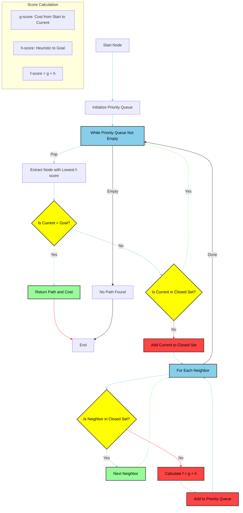

## 10. A* Search Algorithm

Finding the shortest path using a heuristic function.




### Algorithm Explanation

A* is like having a smart GPS that not only knows the distance you've traveled but also has a good guess about how far you still need to go. It combines:
- Dijkstra's algorithm (knowing the exact cost so far)
- Best-First Search (making educated guesses about remaining distance)

Think of it like finding your way in a city:
- You know how far you've walked (g(n))
- You can see how far the destination is (h(n))
- You use both to decide which direction to go (f(n))

#### Key Components:
1. **The Magic Formula: f(n) = g(n) + h(n)**
   - `g(n)`: "How far have I come?"
     - Like looking at your pedometer
     - The actual cost from start to current position
     - Example: "I've walked 3 blocks so far"
   
   - `h(n)`: "How far do I think I still need to go?"
     - Like looking at a map and estimating
     - The predicted cost from current position to goal
     - Example: "I think I need to walk 2 more blocks"
   
   - `f(n)`: "What's my best guess at total distance?"
     - The sum of actual and predicted costs
     - Example: "Total trip will be about 5 blocks"

2. **The Heuristic Function (h(n))**
   - Think of it as your "best guess" function
   - Must follow two rules:
     - Never overestimate (admissible)
       - Like saying "it's at least 2 blocks away"
     - Be consistent (satisfy triangle inequality)
       - Like saying "going through point A can't be faster than going directly"
   
   - Common ways to make these guesses:
     - Manhattan distance: "How many blocks do I need to walk?"
     - Euclidean distance: "What's the straight-line distance?"
     - Chebyshev distance: "How many diagonal moves do I need?"


3. **Algorithm Steps:**
   ```python
   def a_star(start, goal):
       # Keep track of places to visit and places we've seen
       open_set = [(0, start)]  # Places to visit, with their estimated total cost
       closed_set = set()       # Places we've already visited
       
       # Keep track of actual costs and estimated costs
       g_score = {start: 0}     # Actual cost from start to each point
       f_score = {start: h(start)}  # Estimated total cost through each point
       
       while open_set:
           # Visit the place with lowest estimated total cost
           current = min(open_set, key=lambda x: x[0])[1]
           
           # If we reached the goal, we're done!
           if current == goal:
               return reconstruct_path(current)
           
           # Mark current place as visited
           open_set.remove((f_score[current], current))
           closed_set.add(current)
           
           # Look at all neighbors
           for neighbor in get_neighbors(current):
               if neighbor in closed_set:  # Skip if we've already visited
                   continue
               
               # Calculate cost to reach this neighbor
               tentative_g = g_score[current] + cost(current, neighbor)
               
               # If this is a better path to the neighbor, update our records
               if neighbor not in g_score or tentative_g < g_score[neighbor]:
                   g_score[neighbor] = tentative_g
                   f_score[neighbor] = g_score[neighbor] + h(neighbor)
                   open_set.append((f_score[neighbor], neighbor))
   ```

### LeetCode Problems Using A*

1. **LC 773: Sliding Puzzle**
   - Problem: Find minimum moves to solve a 2x3 sliding puzzle
   - Why A*: 
     - Perfect for finding shortest path in state space
     - Manhattan distance heuristic works well for sliding puzzles
     - Each state is a node, moves are edges
   - Time Complexity: O(b^d) where b is branching factor, d is solution depth

2. **LC 752: Open the Lock**
   - Problem: Find minimum turns to reach target combination from "0000"
   - Why A*:
     - State space is well-defined (4-digit combinations)
     - Manhattan distance heuristic works well
     - Each state transition has unit cost
   - Time Complexity: O(10^4) in worst case

3. **LC 1293: Shortest Path in a Grid with Obstacles Elimination**
   - Problem: Find shortest path in grid with k obstacles that can be eliminated
   - Why A*:
     - Grid-based movement with obstacles
     - Manhattan distance is admissible heuristic
     - State includes both position and remaining eliminations
   - Time Complexity: O(m * n * k) where k is number of obstacles that can be eliminated

### Key Benefits of A* in These Problems:
1. **Efficiency:**
   - Avoids exploring unnecessary paths
   - Heuristic guides search toward goal
   - Often faster than BFS/DFS for pathfinding

2. **Optimality:**
   - Guaranteed to find shortest path
   - Works with weighted graphs
   - Handles obstacles and constraints

3. **Flexibility:**
   - Can be adapted to various grid sizes
   - Works with different movement patterns
   - Can incorporate additional constraints
