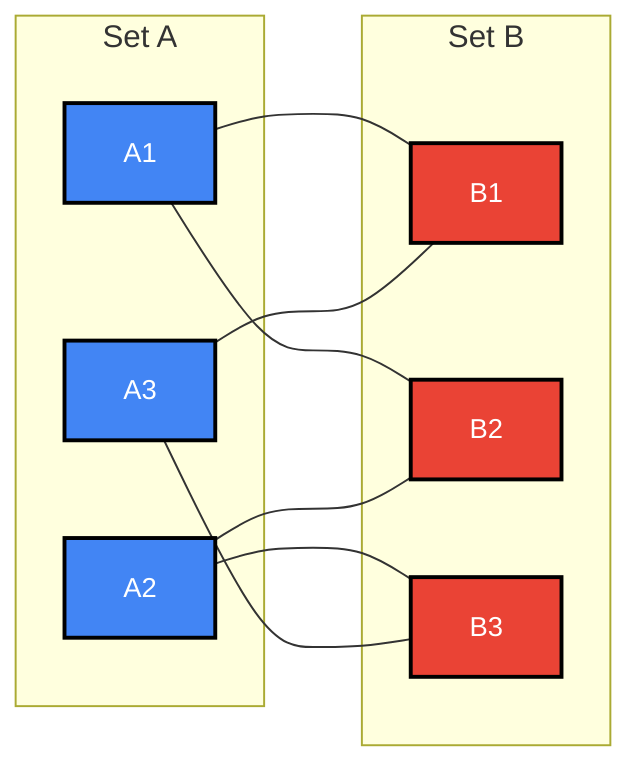
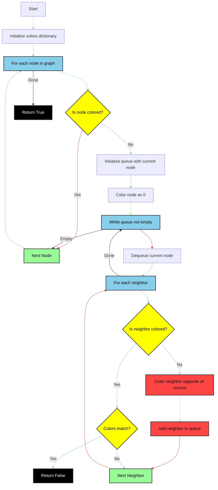

# Bipartite Graph Checking

Helps solve Network flows, Matching Flows. 

## Mental Model



## Data Flow & Transformations in Bipartite Graphs

In bipartite graphs, data flows exclusively between two distinct sets of nodes, never within the same set. This creates a clear directional or relational pattern:

1. **Partitioning Flow**: Vertices are partitioned into two disjoint sets (A and B)
2. **Edge Constraint Flow**: Edges only flow between sets, never within the same set
3. **Matching Flow**: Optimal connections between elements of different sets
4. **Network Flow**: Resource allocation across the bipartite structure

## Key Terminology and Definitions

1. **Bipartite Graph**: A graph whose vertices can be divided into two disjoint sets such that every edge connects a vertex in the first set to one in the second set.

2. **Maximum Bipartite Matching**: The largest possible set of edges where no two edges share a common vertex.

3. **Minimum Vertex Cover**: The smallest set of vertices such that each edge of the graph is incident to at least one vertex in the set.

4. **König's Theorem**: In bipartite graphs, the size of the maximum matching equals the size of the minimum vertex cover.

5. **Hall's Marriage Theorem**: A bipartite graph has a perfect matching if and only if for every subset X of set A, the number of neighbors of X in set B is at least |X|.

6. **Two-Coloring**: The process of coloring vertices such that no adjacent vertices have the same color.

## Mental Model Breakdown: Common Patterns (Most to Least Common)

### 1. Matching Problems
- **Flow Pattern**: One-to-one pairing between elements of set A and set B
- **Example**: Assigning workers to jobs, students to dorms

### 2. Assignment Problems
- **Flow Pattern**: Optimal allocation of resources with constraints
- **Example**: Task scheduling with time/cost constraints

### 3. Network Flow Problems
- **Flow Pattern**: Maximum throughput through a network with capacity constraints
- **Example**: Supply chain optimization

### 4. Set Cover Problems
- **Flow Pattern**: Finding minimum elements to "cover" all relationships
- **Example**: Placing minimum surveillance cameras to cover all intersections

Now, let's look at concrete problem applications:

## LeetCode-Style Problems

1. **Maximum Bipartite Matching**
   - Problem: Find the maximum number of jobs that can be assigned to workers
   - LeetCode examples: "Maximum Number of Accepted Invitations", "Campus Bikes"

2. **Coloring Problems**
   - Problem: Determine if a graph is bipartite (2-colorable)
   - LeetCode example: "Is Graph Bipartite?" (LeetCode #785)

3. **Minimum Vertex Cover**
   - Problem: Find minimum number of vertices to cover all edges
   - LeetCode example: "Minimum Number of Vertices to Reach All Nodes"

## Real-World Applications

1. **Resource Allocation**
   - Matching doctors to patients, teachers to classes, or workers to tasks
   - Optimizing server allocation in distributed computing

2. **Recommendation Systems**
   - Users and items form a bipartite graph; edge weights represent preferences

3. **Job Scheduling**
   - Workers (set A) need to be assigned to jobs (set B) with various constraints

4. **Network Design**
   - Placing servers and clients in a network to minimize connection costs

5. **Stable Marriage Problem**
   - Matching stable pairs between two sets (e.g., college admissions, organ donation)

---

## Bipartite Check Algo: _Decision Tree_



```python
# Depth: O(V) - We process each vertex once
# Breadth: O(E) - We process each edge once
# Final: O(V+E)

from collections import deque

def is_bipartite(graph):
    colors = {}  # 0 for one set, 1 for the other set
    
    for start_node in graph:
        if start_node in colors:
            continue
            
        queue = deque([start_node])
        colors[start_node] = 0  # Color the first node
        
        while queue:
            node = queue.popleft()
            
            for neighbor in graph[node]:
                if neighbor not in colors:
                    colors[neighbor] = 1 - colors[node]  # Assign opposite color
                    queue.append(neighbor)
                elif colors[neighbor] == colors[node]:
                    return False  # Not bipartite
    
    return True

# Example usage:
graph = {
    'A': ['B', 'D'],
    'B': ['A', 'C'],
    'C': ['B', 'D'],
    'D': ['A', 'C']
}
print(is_bipartite(graph))  # Output: True
```
