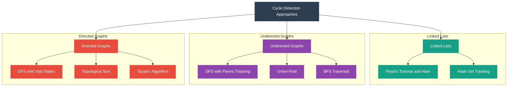

# Cycle Detection in Directed Graphs

Detecting cycles in a directed graph using DFS.



## Data Flow & Transformation Concepts

Let me explain how cycle detection works across these different data structures:

### Common Terminology

- **Cycle**: A path in a graph or linked structure that starts and ends at the same node
- **Node/Vertex**: A data point in a graph or linked structure
- **Edge**: A connection between two nodes
- **Visited Set**: A collection tracking which nodes have been processed
- **Traversal**: The process of visiting all nodes in a structure
- **DFS**: Depth-First Search - explores as far as possible along a branch before backtracking
- **BFS**: Breadth-First Search - explores all neighbors at the present depth before moving deeper

## Mental Model Breakdown by Commonality

### 1. Linked Lists Cycle Detection

The most common approaches, ordered by frequency of use:

1. **Floyd's Tortoise and Hare (Two-Pointer)**
   - **Data Flow**: Two pointers move through the list at different speeds
   - **Data Transformation**: If cycle exists, fast pointer eventually catches up to slow pointer
   - **Efficiency**: O(n) time with O(1) space - highly efficient

2. **Hash Set Tracking**
   - **Data Flow**: Traverse the list, tracking visited nodes in a set
   - **Data Transformation**: If we encounter a previously seen node, a cycle exists
   - **Efficiency**: O(n) time but requires O(n) space

### 2. Undirected Graphs Cycle Detection

1. **DFS with Parent Tracking**
   - **Data Flow**: Perform DFS traversal keeping track of parent for each node
   - **Data Transformation**: If we find an already visited node that's not the parent, cycle exists
   - **Efficiency**: O(V+E) time with O(V) space

2. **Union-Find (Disjoint Set)**
   - **Data Flow**: Process edges one by one, joining connected components
   - **Data Transformation**: If an edge connects nodes already in the same set, cycle exists
   - **Efficiency**: O(E log V) time with O(V) space

3. **BFS Traversal**
   - **Data Flow**: Level by level traversal with parent tracking
   - **Data Transformation**: Similar logic to DFS - finding already visited non-parent node
   - **Efficiency**: O(V+E) time with O(V) space

### 3. Directed Graphs Cycle Detection

1. **DFS with Visit States**
   - **Data Flow**: DFS with nodes in one of three states: unvisited, in-progress, completed
   - **Data Transformation**: If we encounter an in-progress node, a cycle exists
   - **Efficiency**: O(V+E) time with O(V) space

2. **Topological Sort Based**
   - **Data Flow**: Attempt to create a valid topological ordering
   - **Data Transformation**: If impossible (due to back edge), a cycle exists
   - **Efficiency**: O(V+E) time with O(V) space

3. **Tarjan's Algorithm**
   - **Data Flow**: DFS with strongly connected component identification
   - **Data Transformation**: Any SCC with more than one node contains a cycle
   - **Efficiency**: O(V+E) time with O(V) space

Now, let's look at concrete code implementations for the most common patterns:

Would you like me to explain any specific part of the cycle detection implementations in more detail?

| Approach                  | Time Complexity | Space Complexity |
| ------------------------- | --------------- | ---------------- |
| **Linked Lists**          |
| Floyd's Tortoise and Hare | O(n)            | O(1)             |
| Hash Set Tracking         | O(n)            | O(n)             |
| **Undirected Graphs**     |
| DFS with Parent Tracking  | O(V+E)          | O(V)             |
| Union-Find                | O(E log V)      | O(V)             |
| BFS Traversal             | O(V+E)          | O(V)             |
| **Directed Graphs**       |
| DFS with Visit States     | O(V+E)          | O(V)             |
| Topological Sort          | O(V+E)          | O(V)             |
| Tarjan's Algorithm        | O(V+E)          | O(V)             |

```python
# Depth: O(V) - We process each vertex once
# Breadth: O(E) - We process each edge once
# Final: O(V+E)

def has_cycle(graph):
    visited = set()
    rec_stack = set()
    
    def dfs_cycle(node):
        visited.add(node)
        rec_stack.add(node)
        
        for neighbor in graph[node]:
            if neighbor not in visited:
                if dfs_cycle(neighbor):
                    return Tru# ----- LINKED LIST CYCLE DETECTION -----

class ListNode:
    def __init__(self, val=0, next=None):
        self.val = val
        self.next = next

# Floyd's Tortoise and Hare (Two-Pointer) - Most efficient for linked lists
def detect_cycle_floyd(head):
    if not head or not head.next:
        return False
    
    slow = fast = head
    while fast and fast.next:
        slow = slow.next
        fast = fast.next.next
        if slow == fast:
            return True
    return False

# HashSet approach for linked list cycle detection
def detect_cycle_hashset(head):
    seen = set()
    while head:
        if head in seen:
            return True
        seen.add(head)
        head = head.next
    return False

# ----- UNDIRECTED GRAPH CYCLE DETECTION -----

# DFS with Parent Tracking
def detect_cycle_undirected_dfs(graph):
    visited = set()
    
    def dfs(node, parent):
        visited.add(node)
        for neighbor in graph.get(node, []):
            if neighbor == parent:
                continue
            if neighbor in visited or dfs(neighbor, node):
                return True
        return False
    
    return any(dfs(node, -1) for node in graph if node not in visited)

# Union-Find approach for undirected graphs
def detect_cycle_union_find(graph, n):
    parent = list(range(n))
    
    def find(x):
        if parent[x] != x:
            parent[x] = find(parent[x])
        return parent[x]
    
    def union(x, y):
        parent[find(x)] = find(y)
    
    edges_seen = set()
    for node, neighbors in graph.items():
        for neighbor in neighbors:
            edge = tuple(sorted([node, neighbor]))
            if edge in edges_seen:
                continue
            edges_seen.add(edge)
            
            if find(node) == find(neighbor):
                return True
            union(node, neighbor)
    return False

# ----- DIRECTED GRAPH CYCLE DETECTION -----

# DFS with Visit States
def detect_cycle_directed_dfs(graph):
    # 0: unvisited, 1: in-progress, 2: completed
    state = {node: 0 for node in graph}
    
    def dfs(node):
        state[node] = 1  # Mark as in-progress
        for neighbor in graph.get(node, []):
            if state[neighbor] == 1:  # In-progress neighbor → cycle found
                return True
            if state[neighbor] == 0 and dfs(neighbor):  # Unvisited neighbor
                return True
        state[node] = 2  # Mark as completed
        return False
    
    return any(dfs(node) for node in graph if state[node] == 0)

# Topological Sort Based (Kahn's algorithm)
def detect_cycle_topo_sort(graph):
    # Calculate in-degree for each node
    in_degree = {node: 0 for node in graph}
    for node in graph:
        for neighbor in graph.get(node, []):
            in_degree[neighbor] = in_degree.get(neighbor, 0) + 1
    
    # Add nodes with in-degree 0 to queue
    queue = [node for node in in_degree if in_degree[node] == 0]
    visited = 0
    
    while queue:
        node = queue.pop(0)
        visited += 1
        for neighbor in graph.get(node, []):
            in_degree[neighbor] -= 1
            if in_degree[neighbor] == 0:
                queue.append(neighbor)
    
    # If we couldn't visit all nodes, there's a cycle
    return visited != len(graph)

# ----- UTILITY FUNCTIONS -----

# Create a linked list with a cycle
def create_cyclic_linked_list():
    head = ListNode(1)
    node2 = ListNode(2)
    node3 = ListNode(3)
    node4 = ListNode(4)
    
    head.next = node2
    node2.next = node3
    node3.next = node4
    node4.next = node2  # Create cycle pointing to node2
    
    return head

# Create an undirected graph with a cycle
def create_undirected_graph_with_cycle():
    return {
        0: [1, 2],
        1: [0, 3],
        2: [0, 3],  # Edge 2-3 creates a cycle 0-1-3-2-0
        3: [1, 2]
    }

# Create a directed graph with a cycle
def create_directed_graph_with_cycle():
    return {
        0: [1],
        1: [2],
        2: [3],
        3: [1]  # Edge 3->1 creates a cycle 1->2->3->1
    }

# Example usage:
# cyclic_list = create_cyclic_linked_list()
# print("Linked List (Floyd):", detect_cycle_floyd(cyclic_list))
# print("Linked List (HashSet):", detect_cycle_hashset(cyclic_list))

# undirected_graph = create_undirected_graph_with_cycle()
# print("Undirected Graph (DFS):", detect_cycle_undirected_dfs(undirected_graph))
# print("Undirected Graph (Union-Find):", detect_cycle_union_find(undirected_graph, 4))

# directed_graph = create_directed_graph_with_cycle()
# print("Directed Graph (DFS):", detect_cycle_directed_dfs(directed_graph))
# print("Directed Graph (Topo Sort):", detect_cycle_topo_sort(directed_graph))
```list))

# undirected_graph = create_undirected_graph_with_cycle()
# print("Undirected Graph (DFS):", detect_cycle_undirected_dfs(undirected_graph))
# print("Undirected Graph (Union-Find):", detect_cycle_union_find(undirected_graph, 4))

# directed_graph = create_directed_graph_with_cycle()
# print("Directed Graph (DFS):", detect_cycle_directed_dfs(directed_graph))
# print("Directed Graph (Topo Sort):", detect_cycle_topo_sort(directed_graph))
```# print("Linked List (HashSet):", detect_cycle_hashset(cyclic_list))```
