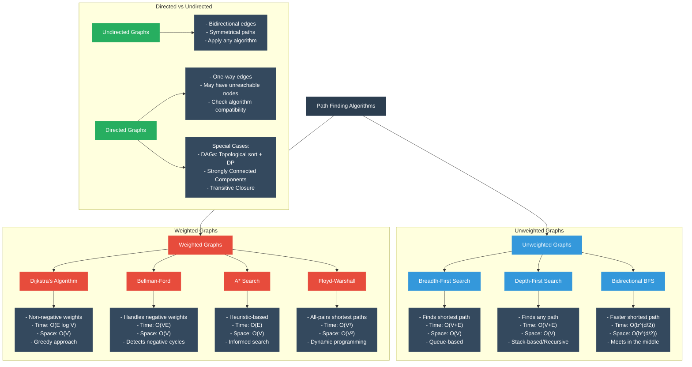

# Path Finding Algorithms: Comprehensive Overview

## Data Flow & Transformation Concepts



### Common Terminology
- **Path**: A sequence of vertices connected by edges
- **Shortest Path**: Path with minimum total edge count (unweighted) or weight sum (weighted)
- **Frontier**: Set of nodes discovered but not yet processed
- **Visited Set**: Nodes that have been fully processed
- **Relaxation**: Process of updating a node's distance if a shorter path is found
- **Heuristic**: Estimated cost from current node to target (used in informed search)

## Mental Model Breakdown by Graph Type

### 1. Unweighted Graph Path Finding

#### Breadth-First Search (BFS)
- **Data Flow**: Starts at source, explores all neighbors before moving to next level
- **Data Structure**: Queue (FIFO)
- **Properties**:
  - Guarantees shortest path (fewest edges)
  - Works on both directed and undirected graphs
  - Time Complexity: O(V+E)
  - Space Complexity: O(V)

#### Depth-First Search (DFS)
- **Data Flow**: Explores as far as possible along each branch before backtracking
- **Data Structure**: Stack or recursion
- **Properties**:
  - Finds any path, not necessarily shortest
  - More memory efficient in some cases
  - Time Complexity: O(V+E)
  - Space Complexity: O(V) worst case, but can be O(h) where h is max depth

#### Bidirectional BFS
- **Data Flow**: Runs two BFS simultaneously, one from source and one from target
- **Data Structure**: Two queues
- **Properties**:
  - Significantly faster for large graphs
  - Still guarantees shortest path
  - Time Complexity: O(b^(d/2)) where b is branching factor and d is distance
  - Only useful when target node is known

### 2. Weighted Graph Path Finding

#### Dijkstra's Algorithm
- **Data Flow**: Greedily selects unvisited node with smallest distance
- **Data Structure**: Priority Queue (Min-Heap)
- **Properties**:
  - Guarantees shortest path for non-negative weights
  - Works on both directed and undirected graphs
  - Time Complexity: O(E log V) with binary heap
  - Cannot handle negative weights

#### Bellman-Ford Algorithm
- **Data Flow**: Relaxes all edges V-1 times
- **Data Structure**: Distance array
- **Properties**:
  - Handles negative weights
  - Detects negative cycles
  - Works on directed graphs
  - Time Complexity: O(VE)
  - Slower than Dijkstra's but more versatile

#### A* Search Algorithm
- **Data Flow**: Combines actual distance and heuristic estimate
- **Data Structure**: Priority Queue ordered by f(n) = g(n) + h(n)
- **Properties**:
  - Informed search (uses domain knowledge)
  - Optimal if heuristic is admissible (never overestimates)
  - Time Complexity: O(E) in best case, exponential in worst case
  - Space Complexity: O(V)

#### Floyd-Warshall Algorithm
- **Data Flow**: Dynamic programming approach finding all pairs shortest paths
- **Data Structure**: 2D distance matrix
- **Properties**:
  - Finds shortest paths between all pairs of vertices
  - Handles negative weights (but not negative cycles)
  - Time Complexity: O(V³)
  - Space Complexity: O(V²)

### 3. Directed vs. Undirected Considerations

#### Undirected Graphs
- All algorithms work on undirected graphs
- Edge (u,v) implies connectivity in both directions
- Path finding is generally more straightforward

#### Directed Graphs
- Must respect edge directions
- Some nodes may be unreachable
- Special cases:
  - **DAGs (Directed Acyclic Graphs)**: Can use topological sort + dynamic programming for O(V+E) shortest paths
  - **Strongly Connected Components**: Preprocessing helps with reachability questions
  - **Transitive Closure**: Useful for determining if any path exists

## Python Implementations

Let's implement the core algorithms for different graph types:

```python
from collections import deque
import heapq
from math import inf

# ---------- UNWEIGHTED GRAPH ALGORITHMS ----------

def bfs_shortest_path(graph, start, end):
    """
    Find shortest path in an unweighted graph using BFS.
    
    Args:
        graph: Dictionary of node -> list of neighbors
        start: Starting node
        end: Target node
        
    Returns:
        shortest_path: List of nodes in the shortest path
    """
    if start == end:
        return [start]
    
    # Queue for BFS
    queue = deque([start])
    # Track visited nodes and their parents
    visited = {start: None}
    
    while queue:
        current = queue.popleft()
        
        # Process neighbors
        for neighbor in graph[current]:
            if neighbor not in visited:
                visited[neighbor] = current
                queue.append(neighbor)
                
                # If we found the target, reconstruct path
                if neighbor == end:
                    path = [neighbor]
                    while current:
                        path.append(current)
                        current = visited[current]
                    return path[::-1]  # Reverse to get start->end
    
    # No path exists
    return []


def dfs_path(graph, start, end):
    """
    Find any path in a graph using DFS.
    
    Args:
        graph: Dictionary of node -> list of neighbors
        start: Starting node
        end: Target node
        
    Returns:
        path: List of nodes in a path (not necessarily shortest)
    """
    def dfs_recursive(current, path, visited):
        if current == end:
            return path + [current]
        
        visited.add(current)
        
        for neighbor in graph[current]:
            if neighbor not in visited:
                result = dfs_recursive(neighbor, path + [current], visited)
                if result:
                    return result
        
        return None
    
    return dfs_recursive(start, [], set()) or []


def bidirectional_bfs(graph, start, end):
    """
    Find shortest path using bidirectional BFS.
    
    Args:
        graph: Dictionary of node -> list of neighbors
        start: Starting node
        end: Target node
        
    Returns:
        shortest_path: List of nodes in the shortest path
    """
    if start == end:
        return [start]
    
    # Forward and backward queues
    forward_queue = deque([start])
    backward_queue = deque([end])
    
    # Track visited nodes and their parents
    forward_visited = {start: None}
    backward_visited = {end: None}
    
    # Track which direction reached each node
    forward_nodes = {start}
    backward_nodes = {end}
    
    def reconstruct_path(intersection, forward_parents, backward_parents):
        # Build path from start to intersection
        path = []
        node = intersection
        while node is not None:
            path.append(node)
            node = forward_parents[node]
        path = path[::-1]  # Reverse to get correct order
        
        # Build path from intersection to end (excluding intersection)
        node = backward_parents[intersection]
        while node is not None:
            path.append(node)
            node = backward_parents[node]
        
        return path
    
    while forward_queue and backward_queue:
        # Expand forward
        for _ in range(len(forward_queue)):
            current = forward_queue.popleft()
            
            for neighbor in graph[current]:
                if neighbor not in forward_visited:
                    forward_visited[neighbor] = current
                    forward_queue.append(neighbor)
                    forward_nodes.add(neighbor)
                    
                    # Check if we found a connection
                    if neighbor in backward_nodes:
                        return reconstruct_path(neighbor, forward_visited, backward_visited)
        
        # Expand backward
        for _ in range(len(backward_queue)):
            current = backward_queue.popleft()
            
            for neighbor in graph[current]:
                if neighbor not in backward_visited:
                    backward_visited[neighbor] = current
                    backward_queue.append(neighbor)
                    backward_nodes.add(neighbor)
                    
                    # Check if we found a connection
                    if neighbor in forward_nodes:
                        return reconstruct_path(neighbor, forward_visited, backward_visited)
    
    # No path exists
    return []


# ---------- WEIGHTED GRAPH ALGORITHMS ----------

def dijkstra(graph, start, end):
    """
    Find shortest path in a weighted graph using Dijkstra's algorithm.
    
    Args:
        graph: Dictionary of node -> list of (neighbor, weight) tuples
        start: Starting node
        end: Target node
        
    Returns:
        shortest_path: List of nodes in the shortest path
        distance: Total distance of the path
    """
    # Priority queue for Dijkstra
    # (distance, node, parent)
    priority_queue = [(0, start, None)]
    # Distances dictionary
    distances = {start: 0}
    # Parents dictionary for path reconstruction
    parents = {start: None}
    # Visited nodes
    visited = set()
    
    while priority_queue:
        distance, current, parent = heapq.heappop(priority_queue)
        
        # Skip if we've already found a better path
        if current in visited:
            continue
        
        # Update parent
        parents[current] = parent
        
        # If we reached the end, reconstruct path
        if current == end:
            path = []
            while current:
                path.append(current)
                current = parents[current]
            return path[::-1], distance
        
        visited.add(current)
        
        # Process neighbors
        for neighbor, weight in graph[current]:
            if neighbor in visited:
                continue
                
            new_distance = distance + weight
            
            # If we found a better path to neighbor
            if neighbor not in distances or new_distance < distances[neighbor]:
                distances[neighbor] = new_distance
                heapq.heappush(priority_queue, (new_distance, neighbor, current))
    
    # No path exists
    return [], inf


def bellman_ford(graph, start, end):
    """
    Find shortest path with possible negative weights using Bellman-Ford.
    
    Args:
        graph: Dictionary of node -> list of (neighbor, weight) tuples
        start: Starting node
        end: Target node
        
    Returns:
        shortest_path: List of nodes in the shortest path
        distance: Total distance of the path
        has_negative_cycle: Boolean indicating if a negative cycle exists
    """
    # Get all nodes
    nodes = set(graph.keys())
    for neighbors in graph.values():
        for neighbor, _ in neighbors:
            nodes.add(neighbor)
    
    # Initialize distances and parents
    distances = {node: inf for node in nodes}
    distances[start] = 0
    parents = {node: None for node in nodes}
    
    # Relax edges |V|-1 times
    for _ in range(len(nodes) - 1):
        for node in graph:
            for neighbor, weight in graph[node]:
                if distances[node] != inf and distances[node] + weight < distances[neighbor]:
                    distances[neighbor] = distances[node] + weight
                    parents[neighbor] = node
    
    # Check for negative cycles
    has_negative_cycle = False
    for node in graph:
        for neighbor, weight in graph[node]:
            if distances[node] != inf and distances[node] + weight < distances[neighbor]:
                has_negative_cycle = True
                break
    
    # If end is unreachable or negative cycle exists
    if distances[end] == inf:
        return [], inf, has_negative_cycle
    
    # Reconstruct path
    path = []
    current = end
    while current:
        path.append(current)
        current = parents[current]
    
    return path[::-1], distances[end], has_negative_cycle


def a_star(graph, start, end, heuristic):
    """
    Find shortest path using A* search with a heuristic function.
    
    Args:
        graph: Dictionary of node -> list of (neighbor, weight) tuples
        start: Starting node
        end: Target node
        heuristic: Function that estimates cost from node to end
        
    Returns:
        shortest_path: List of nodes in the shortest path
        distance: Total distance of the path
    """
    # Priority queue for A*
    # (f_score, g_score, node, parent)
    open_set = [(heuristic(start, end), 0, start, None)]
    # g_score: cost from start to node
    g_scores = {start: 0}
    # f_score: g_score + heuristic
    f_scores = {start: heuristic(start, end)}
    # Closed set (visited nodes)
    closed_set = set()
    # Parents dictionary for path reconstruction
    parents = {start: None}
    
    while open_set:
        _, g_score, current, parent = heapq.heappop(open_set)
        
        # Update parent
        parents[current] = parent
        
        # If we reached the end, reconstruct path
        if current == end:
            path = []
            while current:
                path.append(current)
                current = parents[current]
            return path[::-1], g_score
        
        # Skip if already processed
        if current in closed_set:
            continue
            
        closed_set.add(current)
        
        # Process neighbors
        for neighbor, weight in graph[current]:
            if neighbor in closed_set:
                continue
                
            tentative_g = g_score + weight
            
            if neighbor not in g_scores or tentative_g < g_scores[neighbor]:
                # This path is better than any previous one
                parents[neighbor] = current
                g_scores[neighbor] = tentative_g
                f_scores[neighbor] = tentative_g + heuristic(neighbor, end)
                heapq.heappush(open_set, (f_scores[neighbor], tentative_g, neighbor, current))
    
    # No path exists
    return [], inf


def floyd_warshall(graph):
    """
    Find all-pairs shortest paths using Floyd-Warshall algorithm.
    
    Args:
        graph: Dictionary of node -> list of (neighbor, weight) tuples
        
    Returns:
        distances: Dictionary of (u,v) -> shortest distance
        next_nodes: Dictionary for path reconstruction
    """
    # Get all nodes
    nodes = list(graph.keys())
    for neighbors in graph.values():
        for neighbor, _ in neighbors:
            if neighbor not in nodes:
                nodes.append(neighbor)
    
    # Initialize distances and next node matrix
    distances = {}
    next_nodes = {}
    
    # Set initial distances
    for u in nodes:
        for v in nodes:
            if u == v:
                distances[(u, v)] = 0
                next_nodes[(u, v)] = None
            else:
                distances[(u, v)] = inf
                next_nodes[(u, v)] = None
    
    # Initialize with direct edges
    for u in graph:
        for v, weight in graph[u]:
            distances[(u, v)] = weight
            next_nodes[(u, v)] = v
    
    # Floyd-Warshall algorithm
    for k in nodes:
        for i in nodes:
            for j in nodes:
                if distances[(i, k)] + distances[(k, j)] < distances[(i, j)]:
                    distances[(i, j)] = distances[(i, k)] + distances[(k, j)]
                    next_nodes[(i, j)] = next_nodes[(i, k)]
    
    # Helper function to reconstruct paths
    def get_path(u, v):
        if next_nodes[(u, v)] is None:
            return []
        
        path = [u]
        while u != v:
            u = next_nodes[(u, v)]
            path.append(u)
        
        return path
    
    return distances, next_nodes, get_path


# ---------- SPECIAL CASES FOR DIRECTED GRAPHS ----------

def dag_shortest_path(graph, start, end):
    """
    Find shortest path in a DAG using topological sort + DP.
    
    Args:
        graph: Dictionary of node -> list of (neighbor, weight) tuples
        start: Starting node
        end: Target node
        
    Returns:
        shortest_path: List of nodes in the shortest path
        distance: Total distance of the path
    """
    # Perform topological sort
    def topological_sort():
        visited = set()
        temp = set()
        order = []
        
        def dfs(node):
            if node in temp:
                raise ValueError("Graph has a cycle - not a DAG")
            if node in visited:
                return
            
            temp.add(node)
            
            if node in graph:
                for neighbor, _ in graph[node]:
                    dfs(neighbor)
            
            temp.remove(node)
            visited.add(node)
            order.append(node)
        
        for node in graph:
            if node not in visited:
                dfs(node)
        
        return order[::-1]  # Reverse for correct topological order
    
    try:
        topo_order = topological_sort()
    except ValueError:
        return [], inf  # Not a DAG
    
    # Initialize distances and parents
    distances = {node: inf for node in graph}
    distances[start] = 0
    parents = {node: None for node in graph}
    
    # Process nodes in topological order
    for node in topo_order:
        if distances[node] != inf and node in graph:
            for neighbor, weight in graph[node]:
                if distances[node] + weight < distances.get(neighbor, inf):
                    distances[neighbor] = distances[node] + weight
                    parents[neighbor] = node
    
    # If end is unreachable
    if end not in distances or distances[end] == inf:
        return [], inf
    
    # Reconstruct path
    path = []
    current = end
    while current:
        path.append(current)
        current = parents.get(current)
    
    return path[::-1], distances[end]


# ---------- EXAMPLE USAGE ----------

# Example unweighted graph
unweighted_graph = {
    'A': ['B', 'C'],
    'B': ['A', 'D', 'E'],
    'C': ['A', 'F'],
    'D': ['B'],
    'E': ['B', 'F'],
    'F': ['C', 'E']
}

# Example weighted graph
weighted_graph = {
    'A': [('B', 7), ('C', 9)],
    'B': [('A', 7), ('D', 15), ('E', 8)],
    'C': [('A', 9), ('F', 11)],
    'D': [('B', 15)],
    'E': [('B', 8), ('F', 9)],
    'F': [('C', 11), ('E', 9)]
}

# Example Manhattan distance heuristic for a 2D grid
def manhattan_distance(node1, node2):
    x1, y1 = node1
    x2, y2 = node2
    return abs(x1 - x2) + abs(y1 - y2)
```


## Key Insights and Practical Considerations

### Algorithm Selection by Graph Type

1. **For Unweighted Graphs**:
   - **BFS** is almost always the best choice for shortest path
   - Use **bidirectional BFS** when you know both endpoints and the graph is large
   - Use **DFS** when you only need any path or for memory efficiency in very deep graphs

2. **For Weighted Graphs**:
   - **Dijkstra's algorithm** is the standard choice for non-negative weights
   - **Bellman-Ford** when negative weights may be present
   - **A*** when you have a good heuristic (consistently underestimates distance)
   - **Floyd-Warshall** when you need all-pairs shortest paths

3. **For Directed Acyclic Graphs (DAGs)**:
   - Use **topological sort + dynamic programming** for O(V+E) shortest paths
   - This approach is much faster than Dijkstra's for DAGs

### Real-World Considerations

1. **Memory Efficiency**:
   - BFS generally uses more memory than DFS
   - Bidirectional search can drastically reduce search space
   - With large graphs, consider iterative deepening or memory-bounded search

2. **Heuristic Selection for A***:
   - Must be admissible (never overestimates)
   - Should be consistent (satisfies triangle inequality)
   - Common heuristics:
     - **Manhattan distance** for grid-based movement
     - **Euclidean distance** for 2D/3D space
     - **Landmark heuristics** for road networks

3. **Handling Edge Cases**:
   - Unreachable targets
   - Negative cycles in weighted graphs
   - Disconnected components

4. **Optimization Techniques**:
   - Use adjacency lists for sparse graphs
   - Binary heaps for Dijkstra's implementation
   - Fibonacci heaps for theoretical improvements (rarely practical)
   - Contraction hierarchies for road networks

### LeetCode Problems by Algorithm Type

1. **BFS Path Finding**:
   - LeetCode 1091: Shortest Path in Binary Matrix
   - LeetCode 279: Perfect Squares
   - LeetCode 127: Word Ladder

2. **Dijkstra's Algorithm**:
   - LeetCode 743: Network Delay Time
   - LeetCode 787: Cheapest Flights Within K Stops
   - LeetCode 1631: Path With Minimum Effort

3. **A* Search**:
   - LeetCode 1197: Minimum Knight Moves
   - LeetCode 1263: Minimum Moves to Move a Box

4. **Floyd-Warshall**:
   - LeetCode 399: Evaluate Division
   - LeetCode 1334: Find the City With the Smallest Number of Neighbors

5. **Graph Structure Problems**:
   - LeetCode 997: Find the Town Judge (in-degree vs out-degree)
   - LeetCode 133: Clone Graph
   - LeetCode 990: Satisfiability of Equality Equations

### Advanced Concepts

1. **Bidirectional search** can be extended to work with Dijkstra's algorithm and A* for weighted graphs.

2. **Contraction Hierarchies** pre-process the graph to enable much faster queries at the cost of preprocessing time and space. Extremely effective for road networks.

3. **Delta-stepping** is a parallel version of Dijkstra's algorithm that works well in distributed computing environments.

4. **Multi-goal path finding** optimizes paths to visit multiple destinations, which is related to the Traveling Salesman Problem.

5. **Dynamic graphs** require specialized algorithms that can efficiently update paths when the graph changes.

### Implementation Tips

1. **Use priority queues efficiently**:
   - In Python, use `heapq` for priority queues
   - For Dijkstra's, include both distance and node in the priority tuple

2. **Path reconstruction**:
   - Always maintain a parent/predecessor map during search
   - Reconstruct path by following parents from destination back to source

3. **Early termination**:
   - Once the target is found, you can often stop the algorithm
   - However, with Bellman-Ford or Floyd-Warshall, you need to complete all iterations

4. **Representing graphs**:
   - Adjacency list is usually best for pathfinding (used in our examples)
   - Adjacency matrix can be better for dense graphs or Floyd-Warshall

Would you like me to:
1. Explain any specific algorithm in greater detail?
2. Provide examples of real-world applications for these algorithms?
3. Show how to optimize any particular implementation?
4. Discuss more advanced pathfinding algorithms not covered here?

## Shortest Path using BFS (Unweighted Graphs)

Finding shortest paths in an unweighted graph.

```python
# Depth: O(V) - We process each vertex once
# Breadth: O(E) - We process each edge once
# Final: O(V+E)

from collections import deque

def shortest_path_bfs(graph, start, end):
    if start == end:
        return [start]
    
    visited = {start}
    queue = deque([(start, [start])])
    
    while queue:
        node, path = queue.popleft()
        
        for neighbor in graph[node]:
            if neighbor not in visited:
                new_path = path + [neighbor]
                
                if neighbor == end:
                    return new_path
                
                visited.add(neighbor)
                queue.append((neighbor, new_path))
    
    return None  # No path exists

# Example usage:
graph = {
    'A': ['B', 'C'],
    'B': ['A', 'D', 'E'],
    'C': ['A', 'F'],
    'D': ['B'],
    'E': ['B', 'F'],
    'F': ['C', 'E']
}
print(shortest_path_bfs(graph, 'A', 'F'))  # Output: ['A', 'C', 'F']
```