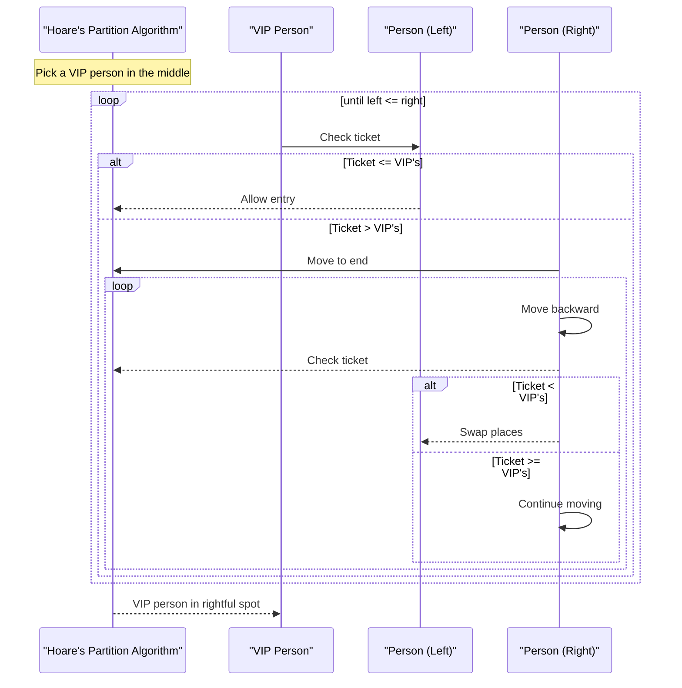

Hoare's partition is an important step in the QuickSort algorithm for sorting arrays. It is used to divide the array into two partitions, one with elements less than or equal to a chosen pivot and the other with elements greater than the pivot.

Imagine you have a line of people waiting to enter a theater. Each person has a number on their ticket, and you want to arrange them in such a way that everyone with a ticket number less than or equal to a chosen "VIP number" goes to the left, and everyone with a ticket number greater than the VIP number goes to the right.

1. You pick a person in the middle of the line and check their ticket number. This person is your "VIP."

2. You start from the beginning of the line (left) and look at each person's ticket. If their ticket number is less than the VIP's, you let them enter the theater and move to the next person.

3. If you encounter someone with a ticket number greater than or equal to the VIP's, you move to the end of the line (right) and work your way backward until you find someone with a ticket number less than the VIP's.

4. When you find such a person on the right side, you swap them with the person on the left side who had a greater ticket number. This effectively moves the person with a smaller ticket number to the left side, and the person with a larger ticket number to the right side.

5. You continue this process until you have checked all the people in the line. Some people may end up in the left group, and some in the right group.

6. Finally, you have the VIP person in their rightful spot, with all the people with smaller ticket numbers on their left and those with larger ticket numbers on their right.

This analogy represents the core mechanics of Hoare's partition algorithm, where you are partitioning elements in an array based on a chosen pivot value to eventually sort the entire array using QuickSort.

```python
# Psuedocode

def hoares_partition(array, left, right):
    pivot = array[right // 2]  # Choose a pivot element (e.g., middle element)
    while left <= right:
        # Move the left pointer to find an element greater than or equal to the pivot
        while array[left] < pivot:
            left += 1
        # Move the right pointer to find an element less than or equal to the pivot
        while array[right] > pivot:
            right -= 1
        # Swap the elements at the left and right pointers
        if left <= right:
            swap(array, left, right)
            left += 1
            right -= 1
    # The pivot element is now in its correct sorted position
    # Recursively apply the partition to the left and right subarrays
    if right > 0:
        hoares_partition(array, 0, right)
    if left < len(array) - 1:
        hoares_partition(array, left, len(array) - 1)

function swap(array, left, right):
    # Helper function to swap two elements in an array
    temp = array[left]
    array[left] = array[right]
    array[right] = temp

# Example usage
array = [3, 4, 9, 1, 7, 0, 5, 2, 6, 8]
hoares_partition(array, 0, len(array) - 1)
print(array)  // The array is now sorted

```


## More Complexity
We can break down the inner workings of Hoare's partition algorithm into five layers of increasing complexity:

**Layer 1 - Basic Partitioning:** _Scanning for Errors_
- In this layer, we start with a simple partitioning step.
- Choose a pivot element from the array (often the last element).
- Initialize two pointers, one at the beginning (left) and one at the end (right) of the array.
- Move the left pointer to the right until you find an element greater than the pivot.
- Move the right pointer to the left until you find an element less than the pivot.
- Swap these elements, if necessary, to place them in the correct partition.
- Continue this process until the left pointer is greater than or equal to the right pointer.

**Layer 2 - Handling Duplicates:** _Pivot group_
- Building upon Layer 1, consider handling duplicate elements.
- Extend the partitioning logic to account for elements equal to the pivot.
- Ensure that elements equal to the pivot end up in the middle, forming a "pivot group."

**Layer 3 - Randomized Pivot Selection:**
- In Layer 3, introduce randomized pivot selection for better performance.
- Instead of always choosing the last element as the pivot, randomly select a pivot element from the array.
- Randomized pivot selection helps prevent **_worst-case time complexity_** scenarios and enhances the algorithm's average-case performance.

**Layer 4 - Recursive QuickSort:**
- Extend the algorithm to perform a full QuickSort using Hoare's partition.
- After the initial partitioning, apply Hoare's partition recursively to both the left and right subarrays.
- This recursive approach ensures that the entire array becomes sorted.

**Layer 5 - Optimizations and Improvements:**
- In this final layer, consider various optimizations and improvements.
- Implement median-of-three pivot selection, where you choose the pivot as the median of three elements (e.g., the first, middle, and last elements). This further reduces the chance of worst-case scenarios.
- Explore multi-threading or parallelization for more efficient sorting on multi-core processors.
- Implement boundary checks and optimizations to reduce unnecessary pointer movement and swaps.
- Handle edge cases and performance improvements, such as switching to another sorting algorithm for small subarrays (e.g., insertion sort for arrays with fewer than a certain number of elements).

Each layer builds upon the previous one, adding complexity and optimizations to Hoare's partition algorithm, ultimately resulting in an efficient and robust sorting algorithm when combined with the appropriate sorting strategy, like QuickSort.

## Complex Topics
- Median-of-Three Pivot Selection:
```python
def median_of_three_pivot(arr, left, right):
    # Calculate the middle index
    mid = left + (right - left) // 2

    # Compare elements at left, middle, and right positions
    a = arr[left]
    b = arr[mid]
    c = arr[right]

    # Find the median among the three elements
    if a < b < c or c < b < a:
        return mid  # Middle element is the median
    elif b < a < c or c < a < b:
        return left  # Left element is the median
    else:
        return right  # Right element is the median

def quicksort(arr, left, right):
    if left < right:
        # Choose the pivot using median-of-three pivot selection
        pivot_index = median_of_three_pivot(arr, left, right)

        # Partition the array and get the new pivot index
        new_pivot_index = partition(arr, left, right, pivot_index)

        # Recursively sort the subarrays
        quicksort(arr, left, new_pivot_index - 1)
        quicksort(arr, new_pivot_index + 1, right)

def partition(arr, left, right, pivot_index):
    # Swap the pivot element with the last element to simplify partitioning
    swap(arr, pivot_index, right)

    # Perform the partitioning
    pivot = arr[right]
    i = left - 1 # Index of smaller element, it starts at -1, because we increment it before doing anything else

    for j in range(left, right): # Notice that we stop at right - 1
        if arr[j] <= pivot: # If element is less than or equal to pivot
            i += 1 # Move the left pointer forward
            swap(arr, i, j) # Swap the element at the left pointer with the element at the current index

    # Place the pivot element in its correct position
    swap(arr, i + 1, right)

    return i + 1 # Return the pivot index

def swap(arr, left, right):
    arr[left], arr[right] = arr[right], arr[left]

# Example usage
arr = [3, 7, 2, 9, 6, 1, 8, 5, 4]
quicksort(arr, 0, len(arr) - 1)
print(arr)  # Sorted array

```